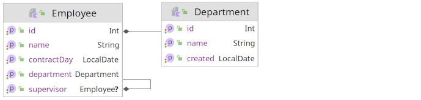

# UjormKt

A very early prototype of the Kotlin library for modelling filters of domain objects.
The solution was inspired by the [Ujorm](https://pponec.github.io/ujorm/www/index.html) key-value framework, but this code is completely new.
Topical areas of use are:

- dynamic validations
- alerting
- modelling conditions for ORM

The ultimate goal of this project is to provide a programming interface (in Kotlin) 
for building a database query model using [DSL](https://en.wiktionary.org/wiki/DSL) ready API, which allows type-safe building of the SQL queries at compile time.
A unique feature is the possibility of **chaining** the properties of the related entities and the simple rules for metamodel building.
An entity here is an interface that does not depend on any parent.
At runtime, a virtual implementation is created from the interface that is based on storing values in the object array. 
Compared to storing data in the `Map` object, this is a more memory-efficient and probably faster solution.

## Examples

Let's have a simple domain model of employees and their departments, where every employee can have a supervisor.



Then the database query (`SELECT`) can look like this:

```kotlin
fun comprehensiveDatabaseSelect() {
    val employees: Employees = MyDatabase.employees // Employee metamodel
    val departments: Departments = MyDatabase.departments // Employee metamodel
    val employeRows: List<Employee> = MyDatabase.select(
        employees.id,
        employees.name,
        employees.department + departments.name, // Required relation by the inner join
        employees.supervisor + employees.name, // Optional relation by the left outer join
        employees.department + departments.created,
    ).where((employees.department + departments.id LE 1) 
        AND (employees.department + departments.name STARTS "D"))
        .orderBy(employees.department + departments.created ASCENDING false)
        .toList()

    expect(employeRows).toHaveSize(1)
    expect(employeRows.first().department.name)
        .toEqual("Development")
}
```

and an `INSERT` for example:

```kotlin
    internal fun insertRows() {
    val development: Department = MyDatabase.departments.new {
        name = "Development"
        created = LocalDate.of(2020, 10, 1)
    }
    val lucy: Employee = MyDatabase.employees.new {
        name = "lucy"
        contractDay = LocalDate.of(2022, 1, 1)
        supervisor = null
        department = development
    }
    val joe: Employee = MyDatabase.employees.new {
        name = "Joe"
        contractDay = LocalDate.of(2022, 2, 1)
        supervisor = lucy
        department = development
    }
    MyDatabase.save(development, lucy, joe)
}
```

## Domain model of the Employee entity

```kotlin
@Entity
interface Employee {
    var id: Int
    var name: String
    var senior: Boolean
    var contractDay: LocalDate
    var department: Department
    var supervisor: Employee?
}

/** Model of the entity can be a generated class in the feature */
open class Employees : EntityModel<Employee>(Employee::class) {
    val id = property { it.id }
    val name = property { it.name }
    val senior = property { it.senior }
    val contractDay = property { it.contractDay }
    val department = property { it.department }
    val supervisor = propertyNullable { it.supervisor }
}

/** Initialize, register and close the entity model. */
val MyDatabase.employees by lazy(LazyThreadSafetyMode.SYNCHRONIZED) {
    MyDatabase.add(Employees().close<Employees>())
}
```

## Basic model usage

New objects are created using the factory method, which provides the interface a necessary implementation.
The values of domain object attributes can be accessed using the interface API, but also through the property descriptors.
Here are some more examples of basic usage of this domain model.

```kotlin
val employees = MyDatabase.employees // Employee metamodel
val departments = MyDatabase.departments // Department metamodel
val employee: Employee = employees.new { // Create new employee object
    id = 11
    name = "John"
    senior = false
    contractDay = LocalDate.now()
    department = createDepartment(2, "D")
}

// Read and Write values by property descriptors:
val id: Int = employee[employees.id]
val name: String = employee[employees.name]
val senior: Boolean = employee[employees.senior]
val contractDay: LocalDate = employee[employees.contractDay]
val department: Department = employee[employees.department]
val supervisor: Employee? = employee[employees.supervisor]
employee[employees.id] = id
employee[employees.name] = name
employee[employees.senior] = senior
employee[employees.contractDay] = contractDay
employee[employees.department] = department
employee[employees.supervisor] = supervisor

// Composed properties:
employee[employees.department + departments.id] = 3
employee[employees.department + departments.name] = "C"
expect(employee.department.id).toEqual(3)
expect(employee.department.name).toEqual("C")
expect(employee[employees.department + departments.id]).toEqual(3)
expect(employee[employees.department + departments.name]).toEqual("C")

// Criterion conditions:
val crn1 = employees.name EQ "Lucy"
val crn2 = employees.id GT 1
val crn3 = (employees.department + departments.id) LT 99
val crn4 = crn1 OR (crn2 AND crn3)
val crn5 = crn1.not() OR (crn2 AND crn3)

expect(crn1(employee)).equals(false) // Invalid employee
expect(crn4(employee)).equals(true)  // Valid employee
expect(crn1.toString()).toEqual("""Employee: name EQ "Lucy"""")
expect(crn2.toString()).toEqual("""Employee: id GT 1""")
expect(crn3.toString()).toEqual("""Employee: department.id LT 99""")
expect(crn4.toString()).toEqual("""Employee: (name EQ "Lucy") OR (id GT 1) AND (department.id LT 99)""")
expect(crn5.toString()).toEqual("""Employee: (NOT (name EQ "Lucy")) OR (id GT 1) AND (department.id LT 99)""")
```

## Class diagram

Common classes of the framework (released: 2022-11-26)


An example implementation of this demo project (released: 2022-11-26)


# What remains to be done

- building remote attribute models (via relationships) is not supported yet (including reading and writing values of POJO)
- API cleaning
- Serialize a `Criterion` object into `JSON` format and parsing the result back to the object.
- Integrate the model filters with the some ORM framework ([Ujorm](https://ujorm.org/www/) ?)
- the domain object model should be generated according to the original POJO objects in feature
- integration with some ORM

# Links

For more information see links to source code of API tests:

* [Basic skills with entity model](https://github.com/pponec/ujormKt/blob/main/src/test/java/org/ujorm/kotlin/core/CoreTest.kt)
* [ORM API desing](https://github.com/pponec/ujormKt/blob/main/src/test/java/org/ujorm/kotlin/orm/OrmTest.kt) 
* Inspired by the [Ujorm framework](https://ujorm.org/www/).