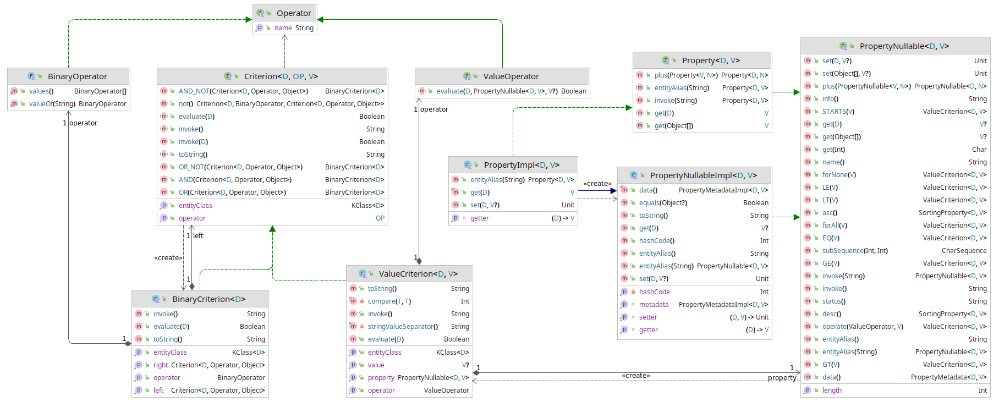

# ujormKt

A very early prototype of the `Kotlin` library for modelling filters using a domain object meta-model.
Assembled filters work on common POJO objects.
The solution was inspired by the [Ujorm](https://pponec.github.io/ujorm/www/index.html) key-value framework, but this code is completely new.
Topical areas of use are:

- dynamic validations
- alerting
- modelling conditions for ORM

# What remains to be done

- building remote attribute models (via relationships) is not supported yet (including reading and writing values of POJO)
- the domain object model should be generated according to the original POJO objects in feature
- API cleaning
- Serialize a `Criterion` object into `JSON` format and parsing the result back to the object.
- Integration of model filters with the `Hibernate` ORM framework


## Usage:

```kotlin
val _user = EntityModelProvider.user

val crn1 = _user.name EQ "Pavel"
val crn2 = _user.id GT 1
val crn3 = _user.id LT 99
val crn4 = crn1 OR (crn2 AND crn3)
val crn5 = crn1.not() OR (crn2 AND crn3)
assert(crn1.toString() == """User: name EQ "Pavel"""")
assert(crn2.toString() == """User: id GT 1""")
assert(crn4.toString() == """User: (name EQ "Pavel") OR ((id GT 1) AND (id LT 99))""")
assert(crn5.toString() == """User: (NOT (name EQ "Pavel")) OR ((id GT 1) AND (id LT 99))""")

val user = User(id = 11, name = "Xaver", born = LocalDate.now())
val noValid: Boolean = crn1(user)
val isValid: Boolean = crn4(user)
assert(!noValid, { "crn1(user)" })
assert(isValid, { "crn4(user)" })

val userName: String = _user.name(user) // Get a name of the user
val userId: Int = _user.id(user)
val parent: User? = _user.parent(user)
//val parentName : String = _user.name.parent(user) // TODO: reading the relations
assert(userName == "Xaver", { "userName" })
assert(userId == 11, { "userId" })
assert(parent == null, { "userId" })

_user.name(user, "James") // Set a name to the user
_user.parent(user, null)
assert(_user.id.name == "id", { "property name" })
assert(_user.id.toString() == "id", { "property name" })
assert(_user.id() == "User.id", { "property name" })
assert(_user.id.info() == "User.id", { "property name" })

val properties = EntityModelProvider.user._properties
assert(properties.size == 4, { "Count of properties" })
assert(properties[0].name == "id", { "property name" })
assert(properties[1].name == "name", { "property name" })
assert(properties[2].name == "born", { "property name" })

// Value type
assert(_user.id.valueClass == Int::class)
assert(_user.born.valueClass == LocalDate::class)

// Entity type (alias domain type)
assert(_user.id.entityClass == User::class)
assert(_user.born.entityClass == User::class)
``````

## Class diagram

Common classes of the framework (released: 2021-07-06)



An example implementation of this demo project (released: 2021-07-07)


For more information see the 
[source code](https://github.com/pponec/ujormKt/blob/main/src/main/java/org/ujorm/kotlin/Demo.kt).